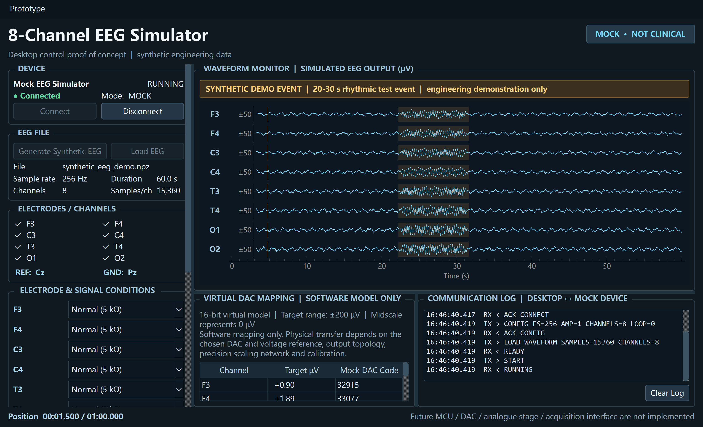

# Eight-Channel EEG Simulator and Verification POC

A desktop and browser engineering proof of concept for **eight-channel EEG waveform generation, playback, fault injection, virtual DAC mapping, device-protocol abstraction, and multi-level verification**.

[](https://github.com/Derekamethy/eight-channel-eeg-simulator/actions/workflows/ci.yml)

[Browser demo source](web_demo/) · [Desktop source code](eeg_simulator/) · [Design decisions](DESIGN_DECISIONS.md) · [Synthetic demo data](data/synthetic_eeg_demo.npz)

**Yangdeyi Yang · Electrical and Electronic Engineering · University College Cork**



## Overview

The prototype models the desktop and verification side of an EEG-simulator workflow. It can generate or load eight-channel EEG-like waveforms, configure channel conditions, map target amplitudes to virtual 16-bit DAC codes, exercise a hardware-independent device interface, and run deterministic software-reference checks.

The implementation deliberately stops at the software/hardware boundary. MCU firmware, physical DAC output, analogue attenuation, electrode-interface hardware, and acquisition-device measurements are not claimed as implemented.

## Interactive browser demo

The Streamlit front end in `web_demo/` is designed as a browser version of the desktop engineering console rather than as a generic data-analysis page. It reuses the maintained signal generator, per-channel condition model, `PlaybackClock`, virtual-DAC mapping, `MockSimulatorDevice` and validation suite.

The browser console provides:

- explicit **Connect / Disconnect** device state and **Start / Pause / Stop / Reset** playback controls;
- automatic playback position driven by the maintained monotonic `PlaybackClock`, with the waveform cursor and DAC table updating during playback;
- a compact fixed **eight-lane EEG monitor** with the 20–30 s synthetic event shaded directly on the traces;
- independent Normal / Moderate / High Z / Very High Z / Lead Off conditions for all eight channels plus global 50/60 Hz interference;
- simultaneous eight-channel **target µV → 16-bit virtual DAC code** inspection at the current playback position;
- a persistent communication log showing the same mock command flow used by the desktop application;
- the three-level deterministic software-reference validation and an explicit implemented / partial / future / external system boundary.

Run it locally from the repository root:

```bash
python -m pip install -r web_demo/requirements.txt
streamlit run web_demo/app.py
```

For Streamlit Community Cloud, use `web_demo/app.py` as the app entry point. The hosted console intentionally does not claim MCU firmware, physical DAC output, analogue attenuation or hardware-in-the-loop measurements.

## Key capabilities

| Capability | Implemented behaviour |
| --- | --- |
| EEG source | Deterministic 8-channel synthetic waveform or NPZ/optional EDF input |
| Browser demo | Desktop-console-style live playback, eight-lane monitor, DAC table and protocol log |
| Default demo | 60 s at 256 Hz, 15,360 samples per channel |
| Channels | F3, F4, C3, C4, T3, T4, O1, O2 |
| Playback | Start, pause, stop, loop and monotonic-clock sample tracking |
| Amplitude control | 0.25×, 0.5×, 1× and 2× digital scaling |
| Virtual DAC | 16-bit unsigned mapping over a configurable ±200 µV digital target range |
| Fault scenarios | Normal, moderate/high/very-high impedance, lead-off, 50/60 Hz interference |
| Device layer | Mock device plus serial-adapter skeleton behind one interface |
| Verification | Simulator-output, acquisition and event-timing checks |
| Automated tests | 41 tests across waveform, DAC, protocol, faults, validation, web controller, visualization and app execution |

## Signal path and system boundary

```text
EEG source
  ↓
Desktop application
  ↓
Device abstraction
  ├─ Mock simulator device                [implemented]
  └─ Serial adapter skeleton              [partial]
          ↓
      MCU / ring buffer / timer / DMA      [future hardware]
          ↓
      DAC / analogue scaling               [future hardware]
          ↓
      Electrode interface                  [future hardware]
          ↓
      Acquisition device                   [external]
          ↓
      Downstream processing / detection
```

The desktop-to-device boundary is intentionally explicit. The GUI does not depend on a particular COM port or firmware implementation; both the mock device and future serial device implement the same `SimulatorDevice` contract.

## Synthetic EEG source

`generate_synthetic_eeg()` creates repeatable engineering data using a fixed random seed. The default dataset contains eight channels sampled at **256 Hz for 60 s**. A deliberately conspicuous rhythmic interval from **20–30 s** is annotated as a synthetic test event so that timing and validation behaviour can be exercised deterministically.

The generated waveform is not intended to reproduce neonatal, seizure, or other clinical EEG morphology. It is test data for software and systems engineering.

## Playback and virtual DAC model

Playback position is derived from elapsed monotonic time rather than GUI refresh ticks, preventing the display timer from becoming the source of sample timing. Channel selection, amplitude scaling and loop state are converted into a device configuration before waveform upload.

`VirtualDAC` maps requested microvolt targets to unsigned 16-bit codes with digital midscale representing 0 µV. This is a software conversion model only. A physical implementation would additionally require a selected converter, voltage reference, analogue scaling/attenuation, output topology, calibration and measured error budget.

## Electrode and signal-condition simulation

The software can apply deterministic per-channel conditions before playback:

- moderate, high and very-high source-impedance previews add controlled noise and pickup;
- lead-off replaces only the selected channel with a deterministic floating/noisy waveform;
- 50 Hz or 60 Hz mains interference can be added across all channels;
- reset returns all channels to the unchanged normal waveform.

These models are intentionally simplified. They are useful for UI behaviour, regression scenarios and protocol testing, but they are not electrical models of a real electrode-skin interface.

## Three-level verification

The reference workflow separates faults by stage instead of reporting one opaque pass/fail result:

1. **Simulator output** — compares the known target with a deterministic mock measurement using RMSE, correlation, gain error and offset.
2. **Acquisition** — compares the target with a deterministic mock acquired waveform using correlation, amplitude ratio and timing offset.
3. **Event timing** — compares the known synthetic event with a deterministic mock detection and checks latency and false-alarm state.

The default software-reference scenario passes all three levels. Thresholds and mock perturbations are explicit in `eeg_simulator/validation.py`; these results demonstrate verification logic, not physical-device performance.

## Repository structure

```text
app.py                           Desktop application entry point
web_demo/
  app.py                         Desktop-console-style Streamlit entry point
  controller.py                  Persistent device/playback state controller
  demo_logic.py                  Shared signal and DAC preparation
  visualization.py               Fixed eight-lane Plotly monitor rendering
  requirements.txt               Hosted-demo dependency set
eeg_simulator/
  eeg_data.py                    EEG model, NPZ and optional EDF I/O
  synthetic_eeg.py               Deterministic 8-channel generator
  playback.py                    Monotonic playback clock
  dac_model.py                   Virtual 16-bit target-to-code mapping
  fault_conditions.py            Electrode/contact and mains scenarios
  protocol.py                    Readable command protocol
  validation.py                  Three-level software-reference checks
  device/                        Abstract, mock and serial device adapters
tests/                           Unit and state-transition tests
scripts/check_release.py         Public-release consistency checks
data/synthetic_eeg_demo.npz      Synthetic demonstration dataset
assets/eeg_simulator_demo.png    Application screenshot
DESIGN_DECISIONS.md              Engineering rationale
.github/workflows/ci.yml         Cross-platform release checks and GUI smoke test
pyproject.toml                   Package metadata and dependencies
requirements.txt                 Direct runtime dependency list
README.md / LICENSE / NOTICE.md  Public documentation and licensing
```

## Quick start

Use Python 3.11 or later:

```bash
python -m venv .venv
# Windows: .venv\Scripts\activate
# macOS/Linux: source .venv/bin/activate
python -m pip install -e .
python app.py
```

Optional EDF import/export support:

```bash
python -m pip install -e ".[edf]"
```

The main GUI can also run a short automated smoke scenario:

```bash
python app.py --smoke-test
```

Run the browser demo separately:

```bash
python -m pip install -r web_demo/requirements.txt
streamlit run web_demo/app.py
```

## Reproducibility

Run the maintained checks with:

```bash
python -m unittest discover -s tests -v
python scripts/check_release.py
```

The tests cover deterministic generation, NPZ round trips, amplitude scaling, virtual-DAC clipping and monotonicity, protocol encode/decode, desktop and web device state transitions, per-channel fault isolation, mains injection, three-level validation, fixed eight-lane monitor rendering and Streamlit console execution. CI also compiles the source tree, executes the Streamlit app through Streamlit's app-testing harness, and runs the offscreen desktop-GUI smoke test.

The synthetic generator, mock measurement path and mock acquisition path all use fixed seeds. This makes software behaviour repeatable across runs, although GUI rendering and floating-point details can vary slightly across platforms and dependency versions.

## Scope and limitations

- This is an engineering proof of concept, not a medical device or clinical application.
- The included waveform is synthetic and carries no diagnostic meaning.
- The virtual DAC does not model physical converter noise, reference error, INL/DNL, output drive or analogue attenuation.
- Source-impedance and lead-off effects are software previews rather than circuit-level electrode models.
- The serial adapter contains the command path but intentionally leaves binary waveform transfer unimplemented until a firmware/framing specification exists.
- The acquisition and detection stages used by the validation suite are deterministic software mocks, not measurements from external hardware.
- MCU timing, DMA, multi-channel DAC updates, analogue circuitry, calibration and hardware-in-the-loop verification remain future implementation work.

The repository therefore demonstrates software architecture, signal-handling logic, verification design and embedded-system planning without overstating hardware or clinical completion.

## License

Source code is released under the [MIT License](LICENSE). See [NOTICE.md](NOTICE.md) for the synthetic-data and non-clinical scope statement.
